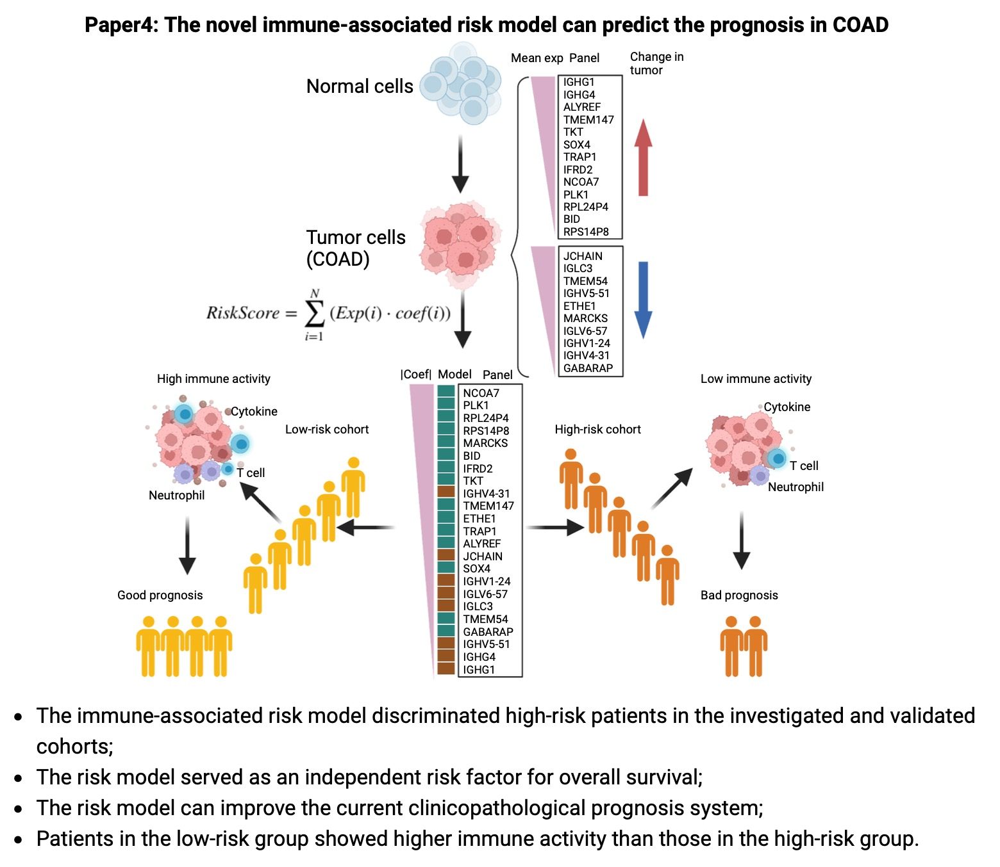

# Module-Based Immune-Associated Gene Signature for Predicting Overall Survival in Colon Adenocarcinoma



This repository contains the code used for the analysis in our research paper titled "Establishment and evaluation of module-based immune-associated gene signature to predict overall survival in patients of colon adenocarcinoma," published in the Journal of Biomedical Science. 

## Publication
**Journal of Biomedical Science**  
**Open Access**  
[Read the full paper](https://jbiomedsci.biomedcentral.com/articles/10.1186/s12929-022-00867-2)

## Overview
This repository contains all the scripts necessary to reproduce the results presented in our paper. By following the pipeline step-by-step, as outlined in the scripts, you can reproduce our analysis and findings.

## Table of Contents
- [Module-Based Immune-Associated Gene Signature for Predicting Overall Survival in Colon Adenocarcinoma](#module-based-immune-associated-gene-signature-for-predicting-overall-survival-in-colon-adenocarcinoma)
  - [Publication](#publication)
  - [Overview](#overview)
  - [Table of Contents](#table-of-contents)
  - [Prerequisites](#prerequisites)
  - [Data Preparation](#data-preparation)
  - [Pipeline Steps](#pipeline-steps)
  - [Reproducing Results](#reproducing-results)
  - [Contact](#contact)
  - [License](#license)
  - [Acknowledgements](#acknowledgements)

## Prerequisites
Before running the scripts, ensure you have the following software and packages installed:
- R (version 4.0 or higher)
- Required R packages (listed in each script)

## Data Preparation
1. **Data Acquisition**: Download the necessary datasets as specified in the paper.
2. **Data Formatting**: Ensure the data is formatted correctly. Specific details can be found in the preparation script (e.g., `merge.pl`).

## Pipeline Steps
The analysis is divided into multiple steps, each labeled by the name of the corresponding script. Follow these steps in order to reproduce the results:

1. **Data Preparation**:
   
2. **Gene Signature Identification**:
   
3. **Survival Analysis**:
   
4. **Model Evaluation**:

5. **Visualization**:

## Reproducing Results
To reproduce the results from the paper, execute each script in the order provided above. Ensure that all intermediate files generated in each step are available for subsequent steps.

Example command to run a script in R:
```r
source("01_data_preparation.R")
```

## Contact
If you have any questions or run into issues, please contact the authors:
- **Jing Lu** - [jing.lu@leibniz-fli.de](mailto:jing.lu@leibniz-fli.de)

We appreciate your interest in our work and are happy to assist with any inquiries regarding the analysis or data.

## License
This project is licensed under the MIT License - see the [LICENSE](LICENSE) file for details.

## Acknowledgements
We thank all contributors and collaborators who supported this research. Special thanks to the funding bodies and institutions for their support.
